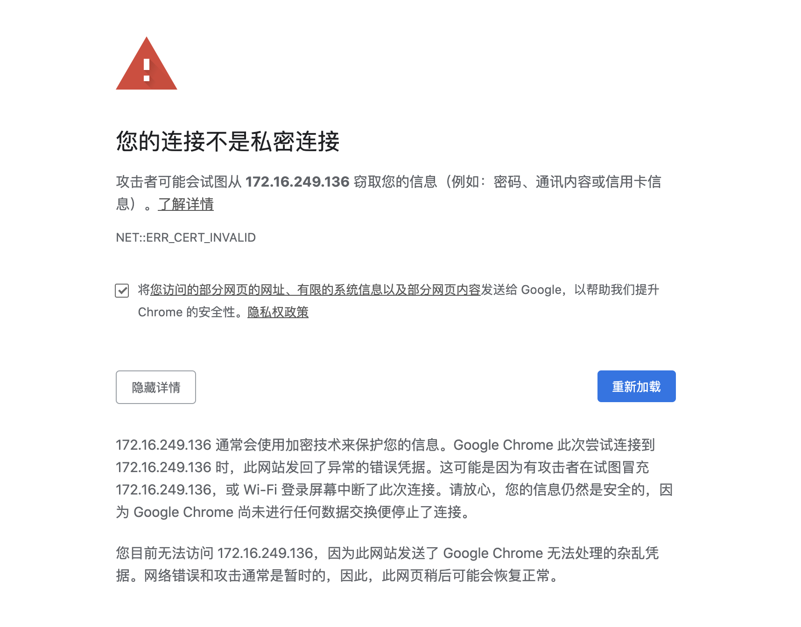

# 四. 部署dashboard
## 1. 部署dashboard 2.x版本

Dashboard 分为 1.x版本 和 2.x版本， k8s 使用的是1.18.4 故部署2.x版本的

```bash
# dashboard 2.x版本的部署
# 上传dashboard配置
$ scp target/addons/recommended.yaml <user>@<node-ip>:/etc/kubernetes/addons/
# 进行部署
$ kubectl apply -f /etc/kubernetes/addons/recommended.yaml
# 查看服务运行情况
$ kubectl get deployment kubernetes-dashboard -n kubernetes-dashboard
$ kubectl -n kubernetes-dashboard get pods -o wide
$ kubectl get services kubernetes-dashboard -n kubernetes-dashboard
$ netstat -ntlp|grep 30005
```

* 部署dashboard 2.x版本的部署说明

  [参考地址](https://github.com/kubernetes/dashboard/releases[)

```bash
# 1. 下载配置文件, 可能需要翻墙，如果不能科学上网访问
#  https://github.com/kubernetes/dashboard/blob/master/aio/deploy/recommended.yaml 拷贝出文件内容
$ wget https://raw.githubusercontent.com/kubernetes/dashboard/v2.0.1/aio/deploy/recommended.yaml
```
```yaml
# 2. 修改配置文件（大约在32行Service段） 在spec 中加入 type: NodePort, nodePort: 30005 配置
kind: Service
apiVersion: v1
metadata:
  labels:
    k8s-app: kubernetes-dashboard
  name: kubernetes-dashboard
  namespace: kubernetes-dashboard
spec:
  type: NodePort
  ports:
    - port: 443
      targetPort: 8443
      nodePort: 30005
  selector:
    k8s-app: kubernetes-dashboard
```
```bash
# 2. 进行部署
$ kubectl apply -f recommended.yaml
```

## 2. 访问dashboard

为了集群安全，从 1.7 开始，dashboard 只允许通过 https 访问，我们使用nodeport的方式暴露服务，可以使用 https://NodeIP:NodePort 地址访问 
关于自定义证书 
默认dashboard的证书是自动生成的，肯定是非安全的证书，如果大家有域名和对应的安全证书可以自己替换掉。使用安全的域名方式访问dashboard。 
在dashboard-all.yaml中增加dashboard启动参数，可以指定证书文件，其中证书文件是通过secret注进来的。

> \- –tls-cert-file  
\- dashboard.cer  
\- –tls-key-file  
\- dashboard.key

## 3. 登录dashboard 2.x
Dashboard 默认只支持 token 认证，所以如果使用 KubeConfig 文件，需要在该文件中指定 token，我们这里使用token的方式登录
```bash
# 创建service account
$ kubectl create sa dashboard-admin -n kubernetes-dashboard

# 创建角色绑定关系
$ kubectl create clusterrolebinding dashboard-admin --clusterrole=cluster-admin --serviceaccount=kubernetes-dashboard:dashboard-admin

# 查看dashboard-admin的secret名字
$ ADMIN_SECRET=$(kubectl get secrets -n kubernetes-dashboard | grep dashboard-admin | awk '{print $1}')

# 打印secret的token
$ kubectl describe secret -n kubernetes-dashboard ${ADMIN_SECRET} | grep -E '^token' | awk '{print $2}'
```
## 4. 谷歌浏览器访问
用谷歌浏览器（chrome）访问 https://NodeIP:30005 地址， 此时浏览器打开后提示证书不授信，怎么办呢？ 马上揭晓答案 呵呵
如下图

**鼠标点击当前页面任意位置(就是那个图片所示的页面)，让页面处于最上层（切记一定要处于当前活动的窗体） 直接键盘敲入这11个字符：thisisunsafe 奇迹就会出现**